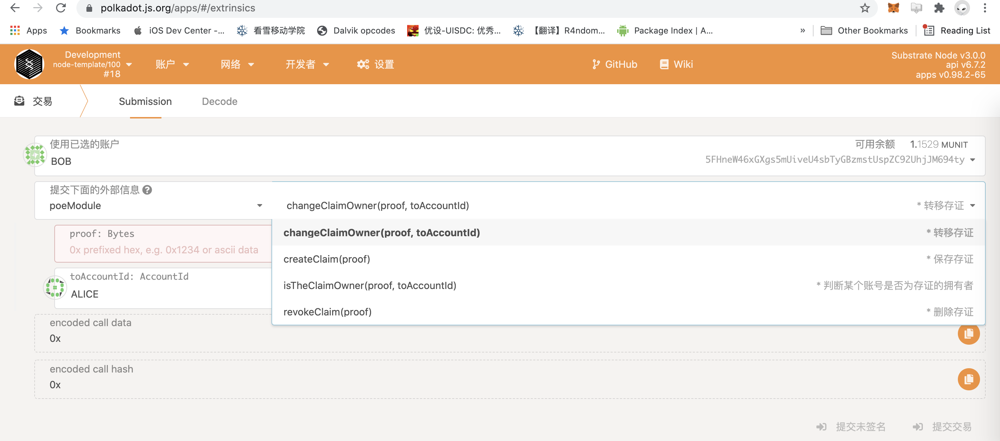

# 存证Poe Pallet开发

源代码位于pallet/poe目录

### Run

Use Rust's native `cargo` command to build and launch the template node:

```sh
cargo run --release -- --dev --tmp
```

### Build

The `cargo run` command will perform an initial build. Use the following command to build the node
without launching it:

```sh
cargo build --release
```

## Run

The provided `cargo run` command will launch a temporary node and its state will be discarded after
you terminate the process. After the project has been built, there are other ways to launch the
node.

### Single-Node Development Chain

This command will start the single-node development chain with persistent state:

```bash
./target/release/node-template --dev
```

Purge the development chain's state:

```bash
./target/release/node-template purge-chain --dev
```

Start the development chain with detailed logging:

```bash
RUST_LOG=debug RUST_BACKTRACE=1 ./target/release/node-template -lruntime=debug --dev
```

## 模块方法
create_claim 保存存证 <br/>
revoke_claim 撤销存证 <br/>
change_claim_owner 转移存证 <br/>

### 运行截图


